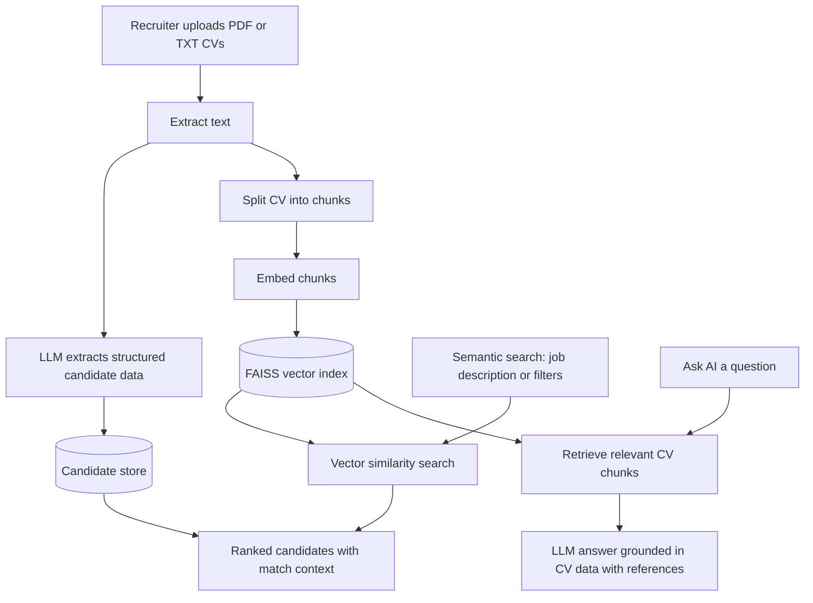

# AI-Powered HR Platform (CV Search + RAG)

Ingest CVs, extract structured candidate data with LLMs, and let recruiters search and question their candidate pool using RAG and vector search.


## The problem

Recruiters spend a lot of time reading CVs one by one to find the few candidates worth a call. The details that matter, like skills, seniority, and location, sit buried inside inconsistent formats, so screening is slow and easy to get wrong. This platform turns a pile of CVs into a searchable, question-answerable candidate pool.

## What it does

- Ingests PDF or TXT CVs and extracts structured data (name, email, phone, location, years of experience, seniority, role, skills) using an LLM.
- Splits each CV into chunks and stores vector embeddings for semantic retrieval.
- Semantic search over natural language job descriptions, with optional filters for role, location, and seniority.
- AI Q&A (RAG) that answers questions grounded in the CV data, with contextual references.
- Dashboard view of total candidates and quick navigation.

## Architecture



## Stack

Backend

- FastAPI
- FAISS (vector similarity search)
- OpenAI / OpenRouter API (structured extraction, embeddings, Q&A)
- NumPy
- PyPDF

Frontend

- HTML
- CSS
- JavaScript

## Preview


## Quick start

1. Clone the repository.
2. Install dependencies.
3. Add your API key.
4. Run the app.
5. Open in the browser.

```bash
git clone <your-repo-url>
cd project
pip install -r requirements.txt
```

Create a `.env` file:

```
OPENROUTER_API_KEY=your_api_key_here
```

Run:

```bash
uvicorn main:app --reload
```

Then open:

- http://localhost:8000
- http://localhost:8000/docs

## How to use

1. Go to Upload CVs and upload PDF or TXT resumes.
2. Go to Semantic Search, then paste a job description or use the filters (role, location, seniority).
3. View ranked candidates with match context.
4. Use Ask AI to query candidates.

Example:

```
Who has strong experience in Python and AWS?
```

## Project structure

```
project/
|
|-- main.py
|-- static/
|   |-- index.html
|   |-- UI.png
|-- requirements.txt
|-- .env
|-- README.md
```

## Limitations (this is a demo version)

- Data stored in memory (resets on restart).
- No authentication system.
- Depends on AI accuracy for parsing.
- Not production-ready.

## Future improvements

- Add a database (PostgreSQL / MongoDB).
- Persistent vector storage.
- Authentication system.
- Better CV parsing models.
- Ranking improvements.
- Docker and cloud deployment.

## Author

Moamen Elsharkawy

## License

Released under the MIT License. See [LICENSE](LICENSE).
