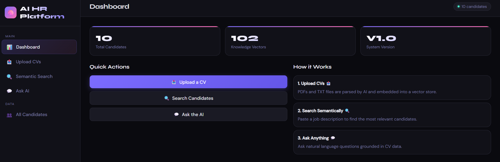

# 🧠 AI-Powered HR Platform (CV Search + RAG)

> Upload CVs → Understand candidates → Find the right match faster

A modern AI-driven HR platform that enables recruiters to **upload CVs, extract structured candidate data, perform semantic search, and ask intelligent questions** using LLMs and vector search.

---

## 🖥️ Preview



---

## ⚡ Quick Start

1. Clone the repository  
2. Install dependencies  
3. Add your API key  
4. Run the app  
5. Open in browser  

```bash
git clone <your-repo-url>
cd project
pip install -r requirements.txt
uvicorn main:app --reload
```

Then open:  
👉 http://localhost:8000

---

## 🧑‍💼 How to Use

1. Go to **Upload CVs**  
   - Upload PDF or TXT resumes  

2. Go to **Semantic Search**  
   - Paste a job description  
   - Or use filters (role, location, seniority)  

3. View ranked candidates with match context  

4. Use **Ask AI** to query candidates  

Example:
```
Who has strong experience in Python and AWS?
```

---

## 🚀 Features

### 📤 CV Ingestion
- Upload **PDF or TXT resumes**
- Extract key information using AI:
  - Name, Email, Phone  
  - Location  
  - Years of Experience  
  - Seniority Level  
  - Role  
  - Skills  
- Automatically splits CVs into chunks for processing  

---

### 🔍 Semantic Search
- Search using **natural language job descriptions**
- Uses vector similarity (FAISS)
- Two search modes:
  - Filter-based (role, location, seniority)
  - Job description / natural language query  

---

### 💬 AI Q&A (RAG)
- Ask questions like:
  - *"Who has experience with AWS and Python?"*
- Answers grounded in CV data  
- Includes contextual references  

---

### 📊 Dashboard
- View total candidates  
- Monitor system activity  
- Quick navigation  

---

### 🎨 Modern UI
- Clean dashboard interface  
- Sidebar navigation  
- Drag & drop CV upload  
- Real-time feedback  

---

## 🏗️ Tech Stack

### Backend
- FastAPI  
- FAISS (vector similarity search)  
- OpenAI / OpenRouter API  
- NumPy  
- PyPDF  

### Frontend
- HTML  
- CSS  
- JavaScript  

---

## 📂 Project Structure

```
project/
│
├── main.py
├── static/
│   ├── index.html
│   └── screenshot.png
├── requirements.txt
├── .env
└── README.md
```

---

## ⚙️ Installation

```bash
git clone <your-repo-url>
cd project
pip install -r requirements.txt
```

Create `.env` file:

```
OPENROUTER_API_KEY=your_api_key_here
```

---

## ▶️ Run

```bash
uvicorn main:app --reload
```

Open:
- http://localhost:8000
- http://localhost:8000/docs

---


## ⚠️ Limitations (becasue it is just a demo version)

- Data stored in memory (resets on restart)
- No authentication system
- Depends on AI accuracy for parsing
- Not production-ready

---

## 🛠️ Future Improvements

- Add database (PostgreSQL / MongoDB)
- Persistent vector storage
- Authentication system
- Better CV parsing models
- Ranking improvements
- Docker & cloud deployment

## 👨‍💻 Author

Moamen Elsharkawy
